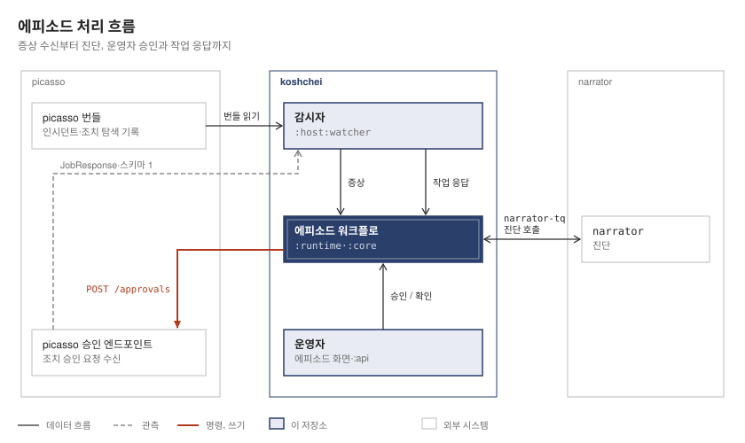

# Koshchei

[](LICENSE.md)


[English README](README.en.md)

koshchei는 로봇 셀에서 발생한 단일 고장을 첫 증상부터 최종 해결까지 하나의 «에피소드»로 추적하는 결정적 상태기계입니다. 로봇 실행 미들웨어인 picasso와 진단을 담당하는 narrator, 두 형제 프로젝트 위에서 동작합니다. Temporal 셸(`:runtime`) 안에 순수하고 결정적인 코어(`:core`)를 두는 구조입니다. 코어는 Temporal, Spring, JDBC에 의존하지 않고 Jackson의 JSON 트리에만 의존하며, 워크플로는 코어의 전이 함수를 실행할 뿐 스스로 판단하지 않습니다. 단일 머신에서 동작하는 개념 증명입니다.

## 프로젝트의 출발점

이 코드는 2026-10-05에 koshei 저장소의 커밋 `6e66dbe`에서 분리되었습니다. koshei에는 PR #4로 설계가, PR #5로 구현이 들어왔습니다. koshchei는 새로운 이력을 시작하며, 분리 이전의 커밋 이력은 koshei에 남습니다. 두 시스템의 성격이 달라 분리했습니다. koshei는 OT/IT 통합을 위한 엔진 중립적 사가 플랫폼 역할을 유지하고, koshchei는 에피소드 루프만 담당합니다.

분리하면서 패키지, 환경 변수, 데이터베이스, DB 역할, 작업 큐의 이름을 koshchei로 변경했습니다. 예를 들어 `KOSHEI_PICASSO`는 `KOSHCHEI_PICASSO`로, 큐 `koshei-episode-tq`는 `koshchei-episode-tq`로 바뀌었습니다. 외부 계약의 이름은 유지했습니다. narrator의 큐 `narrator-tq`와 액티비티 `diagnose`, picasso 승인 엔드포인트의 스키마 4와 ResultExport의 스키마 1은 그대로입니다. 동작도 유지했지만 한 가지 예외가 있습니다. 이제 워커는 에피소드 워커만 실행하므로, `KOSHCHEI_PICASSO`가 설정되지 않았거나 `off`이면 시작하지 않습니다.

포트와 데이터베이스도 변경했습니다. Postgres는 15432 → 15433으로 바뀌었으며, 데이터베이스는 `koshei` 대신 `koshchei`를 사용합니다. HTTP API는 18090 → 18190, UI 개발 서버는 5173 → 5174로 바뀌었습니다. 분리 이전에 작성된 에피소드 감사 기록은 koshei의 데이터베이스에 남으며, koshchei는 빈 테이블에서 시작합니다.

## 동작 방식

<picture>
  <source media="(prefers-color-scheme: dark)" srcset="docs/diagrams/flow.dark.svg">
  
</picture>

- **증상 수신.** 감시자 프로세스(`:host:watcher`)가 picasso에서 내보낸 인시던트 줄과 조치 탐색 기록을 읽어 에피소드에 신호로 전달합니다. 정책 테이블 v1에는 상관 규칙이 하나 있습니다. 같은 로봇의 조치 탐색 기록과 인시던트 줄이 같은 작업 지시에 속하면 하나의 에피소드로 묶습니다.
- **진단.** narrator는 Temporal 큐 `narrator-tq`에서 응답합니다(진단 계약 0.6). 조치를 직접 서술하지 않고 koshchei가 계산한 후보 가운데 하나를 가리킵니다. 후보 안의 권고이면서 검증된 인용이 최소 하나 있을 때만 승인 요청으로 이어집니다. 그 밖의 결과(근거 없음, 인용 없음, ESCALATE 권고, 계약 위반)는 운영자에게 인계합니다.
- **승인과 디스패치.** 운영자가 조치를 승인합니다. 정책 테이블 v1에서는 자동 승인을 꺼 둡니다. 코어는 사전 조건을 재검증하고 디스패치 의도 기록을 남긴 뒤에야 picasso 승인 엔드포인트(`POST /approvals`, `KOSHCHEI_PICASSO=picasso`) 또는 목 승인 클라이언트(`KOSHCHEI_PICASSO=mock`)로 디스패치합니다.
- **해결.** picasso의 작업 응답은 감시자를 거쳐 돌아옵니다. 승인된 실행 단계가 모두 완료되고, 의심 상태인 항목이 없으며, 로봇의 연결 상태가 ONLINE일 때만 에피소드가 DONE이 됩니다. 그렇지 않으면 UNKNOWN에 머물거나 운영자에게 인계합니다.
- **인터페이스.** HTTP API `/api/episodes…`(`:api`, 포트 18190), `ui/`의 에피소드 화면(Vite 개발 서버 포트 5174), 개발자 CLI(`:host:cli`, `open`과 `agent-off <workflowId>|--all`)를 제공합니다.

## 예제로 보는 picasso 번들과 에피소드

### picasso 번들: 탐색 결과와 고장 기록을 담은 디렉터리

picasso 번들은 picasso가 내보낸 디렉터리입니다. `incidents.jsonl`과 `remedy-searches.jsonl`을 먼저 쓰고 `manifest.json`을 마지막에 쓰며, 각 파일은 이름 변경으로 반영합니다. koshchei는 LedgerExport 스키마 `"5"`를 읽습니다. 커밋된 샘플 `runtime/src/test/resources/picasso/run-1/`에는 다음 세 파일이 있습니다.

- `manifest.json`: 내보내기의 `schemaVersion`, `runId`, 파일별 줄 수입니다. koshchei는 `counts`에 지정된 수만큼 각 파일의 앞부분을 읽습니다.
- `remedy-searches.jsonl`: 로봇의 작업 지시에 대해 picasso가 수행한 조치 탐색 기록입니다. 샘플에는 4줄이 있습니다.
- `incidents.jsonl`: 인시던트 하나당 한 줄입니다. 샘플에는 9줄이 있습니다.

아래 JSON은 샘플에서 읽는 필드만 남긴 예입니다. 실제 처리에서는 해석하지 않는 필드도 버리지 않고 원문 전체를 보존하여 narrator의 진단 스냅샷과 오퍼레이터 카드의 증상 목록에 전달합니다. `manifest.json`도 에피소드와 진단 요청에 원문 그대로 포함됩니다.

`manifest.json`:

```json
{"schemaVersion":"5","runId":"run-2026-09-22T16:47:37.854173400Z-1","counts":{"incidents":9,"remedySearches":4}}
```

`remedy-searches.jsonl`의 첫 줄:

```json
{"searchId":"search-1","robotId":"hum-02","jobOrderId":"PATROL-1","outcome":"FOUND","steps":[{"skillType":"pick_place"}]}
```

이는 picasso가 로봇 `hum-02`의 작업 지시 `PATROL-1`에 대해 `pick_place` 실행 단계 하나로 구성된 조치를 찾았다는 기록입니다. 원문에서 탐색 시각은 `00:00:01`입니다. 나머지 탐색 결과는 `search-2`가 `NONE`, `search-3`가 `WITHHELD`, `search-4`가 `SOURCE_MISSING`입니다. `WITHHELD`는 진단 전에 운영자 인계로 이어집니다.

`incidents.jsonl`의 첫 줄:

```json
{"incidentId":"incident-1","jobOrderId":"PATROL-1","executionId":"exec-2","robotId":"hum-02","unitId":"remedy-1-pick_place","at":"2026-09-06T00:00:02Z","unresolved":false,"observation":{"linkBroken":false,"lateEvents":[],"progressObservable":true,"progressStalled":false},"verification":"NOT_REQUESTED","resolution":null,"digest":"d04ac2a20a63afc2ba147218bae871ef69746c990e3993deb00cfb4ddd262143"}
```

이 기록은 같은 로봇과 작업 지시의 실행 단계 `remedy-1-pick_place`에서 `00:00:02`에 발생한 인시던트입니다. 원문의 `failureClass`는 `PAYLOAD_LOST`입니다. koshchei는 `digest`로 에피소드 이벤트의 `eventId`인 `incident:<runId>:<digest>`를 만들고, `observation`에서 미관측 조건을, `unresolved`·`resolution`·`verification`에서 운영자 결정 후보를 도출합니다.

작업 응답은 이 번들에 들어 있지 않습니다. 나중에 별도 파일 `job-responses.jsonl`로 도착하며, ResultExport 스키마 1의 JobResponse 하나가 한 줄을 차지합니다. 감시자는 이를 `jobOrderId`로 에피소드에 전달합니다. `run-1`에는 작업 응답이 없으며, 다음은 테스트에서 가져온 응답 형식의 예입니다.

```json
{"schemaVersion":"1","instanceId":"mw-1","jobResponseId":"resp-1","jobOrderId":"PATROL-1","executionId":"exec-1","physicalState":"PHYSICALLY_DONE","reachedEvidence":"E1","completedUnits":["remedy-1-pick_place"],"unverifiedUnits":[],"inDoubtUnits":[],"operatorRequired":false,"connection":"CONNECTION_STATE_ONLINE"}
```

### 에피소드: 이 증상에 대한 판단과 조치의 진행 기록

아래 빠른 시작은 `KOSHCHEI_PICASSO=mock`, 기본값인 `KOSHCHEI_NARRATOR=mock`, 정책 테이블 v1을 사용합니다. `open`에서 `--search search-1 --key koshchei-demo-1`을 지정하면 워크플로 ID `ep:koshchei-demo-1`인 에피소드가 열립니다. CLI는 `search-1` 한 줄만 증상으로 전달하며, `eventId`는 `search:<runId>:search-1`입니다.

여기서 `<runId>`는 위 manifest의 `runId`를 뜻합니다. CLI는 상관 규칙을 적용하지 않으므로 빠른 시작의 에피소드에는 `incident-1`이 합류하지 않습니다. 감시자로 같은 번들을 읽으면 두 기록의 `robotId`와 `jobOrderId`가 같아 `search-1`과 `incident-1`이 하나의 에피소드로 묶입니다.

`search-1`의 후보는 정확히 `["APPROVE_REMEDY:hum-02:PATROL-1:pick_place","ESCALATE"]`입니다. 목 narrator는 `ESCALATE`가 아닌 첫 후보를 권고합니다. 다음은 응답의 필드를 줄인 예이며, `<runId>`는 위와 같은 자리표시자입니다.

```json
{"contractVersion":"0.6","episodeId":"ep:koshchei-demo-1/<runId>","attempt":1,"outcome":"RECOMMENDED","candidateId":"APPROVE_REMEDY:hum-02:PATROL-1:pick_place","citations":[{"title":"mock-sop","section":"1","verified":true}]}
```

제시한 후보 ID와 후보 버전이 일치하고 검증된 인용이 있으므로 이 권고는 조치 제안으로 받아들여집니다. 자동 승인이 꺼져 있어 운영자의 승인을 기다립니다. 운영자가 승인하는 경로의 페이즈는 다음과 같습니다.

| 페이즈 | 이 예에서 일어나는 일 |
|---|---|
| `CORRELATING` | 5초 동안 상관 대기합니다. 에피소드 전체의 제한 시간 1시간도 시작됩니다. |
| `DIAGNOSING` | `narrator-tq`로 진단 요청을 보냅니다. |
| `AWAITING_APPROVAL` | `APPROVAL_NEEDED` 알림을 보내고 최대 5분 동안 승인을 기다립니다. 거절하면 `DIAGNOSING`으로 돌아가며, 응답이 없으면 `ESCALATED` (`APPROVAL_EXPIRED`)로 전이합니다. |
| `REVALIDATING` | 사전 조건을 재검증합니다. 목 클라이언트는 제안이 소모되지 않은 동안 `TRUE`로 응답합니다. |
| `DISPATCH_PENDING` | 디스패치 의도 기록을 먼저 남깁니다. |
| `DISPATCHED` | 목 승인 클라이언트가 실행 단계 `remedy-1-pick_place`에 대해 `APPROVED`, `executionId` `mock-exec-1`로 응답합니다. |
| `AWAITING_EVIDENCE` | 완료 증빙을 기다립니다. 빠른 시작에는 감시자가 없어 작업 응답이 도착하지 않습니다. |

에피소드 화면의 목록에는 `ep:koshchei-demo-1`과 현재 페이즈가 표시됩니다. 상세 화면의 오퍼레이터 카드에는 증상 목록인 `search-1` 원문, `APPROVE_REMEDY` 조치 제안과 `robotId`·`jobOrderId`·`searchId`, 이유와 인용 `mock-sop · 1`이 표시됩니다. `AWAITING_APPROVAL`에서는 `Approve` / `Reject`, `AWAITING_EVIDENCE`에서는 `DONE` / `NOT DONE` 버튼으로 결정합니다.

운영자가 `DONE`을 확인하면 `RESOLVED`로 전이하고, `NOT DONE`을 확인하면 새 진단 호출로 이어집니다. 완료 증빙 없이 10분이 지나면 `ESCALATED` (`EVIDENCE_EXPIRED`)로 전이합니다. 이후 운영자가 에피소드를 닫으면 `CLOSED`가 되며, 닫지 않으면 24시간 뒤 `UNATTENDED` 사유로 `CLOSED`가 됩니다. 즉 번들은 입력 기록이고, 에피소드는 그 증상을 바탕으로 진단·승인·실행 결과 확인을 추적하는 단위입니다.

## 함께 사용하는 시스템

- picasso: koshchei는 picasso 승인 엔드포인트(`POST /approvals`, 스키마 4)에 승인 요청을 보내고, picasso의 작업 응답(JobResponse 줄, ResultExport 스키마 1)을 읽습니다. 승인 엔드포인트는 루프백에서만 접근할 수 있습니다.
- narrator: Temporal 큐 `narrator-tq`의 `diagnose` 액티비티를 사용하며, 진단 계약은 0.6입니다. `KOSHCHEI_NARRATOR=mock`(기본값)이면 koshchei 워커가 목 narrator 액티비티로 해당 큐를 직접 처리합니다. `remote`이면 narrator 자체 워커가 처리합니다.
- Temporal: koshchei는 narrator 워커와 picasso가 사용하는 것과 같은 `localhost:7233`의 Temporal 서버를 사용합니다. 자체 Docker Compose 파일은 Postgres만 시작합니다(데이터베이스 `koshchei`, 호스트 포트 15433). 전용 Temporal은 `docker compose --profile temporal up -d`로만 시작하며, 7233을 사용 중인 프로세스가 없는 머신을 위한 구성입니다.
- Temporal 공유: koshchei가 분리되어 나온 koshei 저장소에는 이제 에피소드 루프가 없습니다. koshei의 main 브랜치에서 커밋 335946a(koshei PR #11, 2026-10-05)로 제거되었습니다. 다만 335946a 이전의 koshei 빌드와 그 빌드가 공용 Temporal 서버에서 시작해 아직 열려 있는 에피소드에는 공유 시 주의사항이 여전히 적용됩니다. 정책 테이블 v1에서 운영자에게 인계된 에피소드는 24시간 동안 열려 있습니다. 같은 Temporal 서버에서 koshchei와 koshei는 워크플로 타입 `EpisodeWorkflow`, 워크플로 ID `ep:<key>`, narrator의 큐 `narrator-tq`를 공유합니다. 따라서 `agent-off --all`은 koshei의 열린 에피소드에도 전달되며, `open`으로 지정한 ID가 koshei에서 실행 중이면 koshei의 실행에 신호를 보냅니다. 공용 서버에서는 `--key`에 koshchei 전용 접두사를 지정하거나, narrator 워커가 실행 중이면 `KOSHCHEI_NARRATOR=remote`를 설정하거나, 7233을 사용 중인 프로세스가 없는 머신에서 전용 Temporal(`docker compose --profile temporal up -d`)을 사용하세요. 자세한 내용은 [`docs/usage.md`](docs/usage.md#sharing-temporal) §1에 있습니다.

## 모듈

| 모듈 | 구성 |
|---|---|
| `:core` | 순수 코어: 에피소드 상태기계, 전이 함수, 정책 테이블, 후보, 진단 요청과 판정. Jackson의 JSON 트리에만 의존합니다. |
| `:runtime` | Temporal 셸: `EpisodeWorkflow`와 액티비티, 에피소드 테이블(`EpisodeStore`), 감시자 로직, 목 narrator 액티비티, 목 승인 클라이언트와 실환경 실행용 승인 클라이언트(`HttpApprovalClient`), `Db`. |
| `:host` | 실행 프로세스: 에피소드 워커(`:host:run`), 감시자(`:host:watcher`), 개발자 CLI(`:host:cli`). |
| `:api` | Spring Boot HTTP API. 포트 18190에서 `/api/episodes…`를 제공합니다(`:api:run`). |
| `ui/` | Vite + React 기반 에피소드 화면. 개발 서버 포트는 5174이며, Gradle 모듈이 아닙니다. |

의존성은 `core` ← `runtime` ← `host`, `runtime` ← `api` 방향으로만 이어집니다. 어떤 모듈도 koshei 모듈에 의존하지 않습니다. koshei의 공용 모듈에서 가져온 작은 구성 두 가지(raw-JSON 데이터 변환기와 `Db` 연결 설정)는 `:runtime`으로 복사했습니다. `ui/`는 Gradle 빌드 밖에 있는 React 앱입니다.

## 목 승인 클라이언트로 빠르게 시작하기

아래 명령은 Postgres, 목 승인 클라이언트를 사용하는 에피소드 워커, HTTP API, 에피소드 화면을 시작하고, 저장소에 커밋된 샘플 번들에서 에피소드 하나를 엽니다.

```bash
docker compose up -d --wait           # 호스트 포트 15433의 koshchei Postgres
# Temporal: localhost:7233의 공용 서버 사용. 실행 중인 서버가 없으면: docker compose --profile temporal up -d

# 터미널 1: koshchei-episode-tq의 에피소드 워커와 narrator-tq의 목 narrator
export KOSHCHEI_PICASSO=mock
./gradlew :host:run

# 터미널 2: 127.0.0.1:18190의 HTTP API (/api/episodes…)
./gradlew :api:run

# 터미널 3: http://localhost:5174의 에피소드 화면
cd ui && npm install && npm run dev
```

`--args` 안의 경로는 작은따옴표(`'…'`)로 감싸야 합니다. Gradle은 `--args`를 공백 기준으로 나누되 따옴표는 인식하며, 체크아웃 경로에 공백이 있을 수 있습니다. Git Bash의 `$PWD`는 `/c/...` 형식이라 JVM이 다른 경로로 읽습니다. `C:/...` 형식을 반환하는 `$(pwd -W)`를 사용하세요. 아래 명령은 `--key koshchei-demo-1`을 지정하므로, 워크플로 ID `ep:koshchei-demo-1`이 공용 Temporal 서버에서 koshei가 같은 샘플 번들로 연 에피소드와 충돌하지 않습니다.

```bash
# 터미널 4: 커밋된 샘플 내보내기에서 에피소드 하나 열기
# Linux / macOS
./gradlew :host:cli --args="open --export '$PWD/runtime/src/test/resources/picasso/run-1' --search search-1 --key koshchei-demo-1"

# Windows의 Git Bash
./gradlew :host:cli --args="open --export '$(pwd -W)/runtime/src/test/resources/picasso/run-1' --search search-1 --key koshchei-demo-1"
```

```powershell
# 터미널 4, PowerShell
./gradlew :host:cli --args="open --export '$PWD\runtime\src\test\resources\picasso\run-1' --search search-1 --key koshchei-demo-1"
```

워커나 감시자를 시작하는 모든 셸에 같은 `KOSHCHEI_PICASSO` 값을 설정하세요. 각 프로세스는 자기 환경 변수만 읽습니다. `KOSHCHEI_PICASSO=mock`이면 조치가 로봇에 전달되지 않으며, 워커가 시작할 때 경고를 출력합니다. `:host:cli` 태스크는 `host/`를 작업 디렉터리로 사용하므로 번들 경로는 절대 경로여야 합니다. 에피소드를 연 뒤 http://localhost:5174에 접속하세요. 정책 테이블 v1에서는 운영자가 승인해야 목 승인 클라이언트로 디스패치합니다. 이 빠른 시작에서는 감시자를 실행하지 않으므로 작업 응답이 도착하지 않습니다. 운영자가 실행 결과를 확인하거나, 완료 증빙 제한 시간(정책 테이블 v1에서 10분)이 지나면 에피소드를 운영자에게 인계합니다. 감시자와 실환경 실행용 승인 엔드포인트를 포함한 전체 가이드는 `docs/usage.md`에 있습니다.

## 테스트

```bash
./gradlew test          # 테스트 705개: core 323, runtime 311 (1개 건너뜀), host 29, api 42

cd ui
npm install             # 최초 실행 시에만 필요
npm test                # Vitest: 테스트 41개
npm run test:e2e        # Playwright: 준비 단계 후 테스트 20개 (먼저 npm run dev 중지, Google Chrome 필요)
```

`./gradlew test`는 테스트 705개를 실행하며 실패는 0개, 건너뛴 테스트는 1개입니다. 건너뛴 테스트는 커밋된 재생 이력을 생성하는 용도로, 명시적으로 요청할 때만 실행합니다. runtime 테스트는 분리 이전에 기록하고 커밋한 워크플로 이력 9개(`runtime/src/test/resources/replay/2026-10-04/`)를 명칭이 변경된 코드로 재생합니다. 데이터베이스 테스트는 Testcontainers(`postgres:16`)를 사용하므로 Docker가 실행 중이어야 합니다. UI 엔드투엔드 테스트는 페이지에서 `/api/episodes`를 스텁으로 대체합니다. 실행 중인 백엔드를 대상으로 하는 엔드투엔드 테스트는 없습니다.

## 범위와 한계

아래 항목은 단일 머신 개념 증명인 koshchei의 한계와 실환경 검증 이력을 정리한 것입니다.

- 분리 이전 koshei에서 실환경 실행을 두 번 수행했습니다. 2026-10-03에는 `narrator-tq`를 통해 narrator와 khala를 사용하는 진단을 한 번 실행했습니다. 인용 13개 중 13개가 검증되었고 narrator가 ESCALATE를 권고하여 에피소드를 운영자에게 인계했습니다. 2026-10-04에는 picasso의 참조 호스트를 대상으로 한 번 실행했습니다. 운영자가 조치를 승인하고 picasso가 APPROVED로 응답했지만, 연결된 JobResponse에 `operatorRequired`가 있어 에피소드가 UNKNOWN_OUTCOME으로 전이했습니다.
- 배포용 호스트는 아직 없습니다. 별도 배포 저장소에 둘 예정이며, 그때까지는 picasso의 참조 호스트를 테스트 상대 시스템으로 사용합니다.
- 실환경 실행용 승인 엔드포인트에서는 picasso 기록의 최신 상태를 조회하지 않으므로 재검증 결과가 항상 UNKNOWN입니다. 따라서 디스패치 전에 운영자가 각 사전 조건을 확인합니다.
- DONE이 조치 완료를 뜻해야 하는지, 작업 지시 전체의 완료를 뜻해야 하는지는 미결 사항입니다(설계 §19 F). 현재는 승인된 실행 단계가 모두 완료되어도 작업 지시 수준의 `operatorRequired`가 있으면 에피소드가 UNKNOWN_OUTCOME에 머뭅니다.
- 승인 엔드포인트는 루프백에서만 접근할 수 있으므로 koshchei는 picasso 호스트와 같은 머신에서 실행해야 합니다.
- 현재 범위 외 항목: 정책 테이블 관리(git + DB 포인터 + CLI), `SAGA_ACTION` 조치와 하위 사가, 감사 기록의 전체 필드와 품질 이력 연결, 감시 로그 화면, HTTP API용 읽기 전용 데이터베이스 역할.
- HTTP API에는 인증이 없습니다. `KOSHCHEI_BIND_ADDRESS`로 다른 주소를 지정하지 않으면 `127.0.0.1`에서 수신합니다.

## 문서

- [`docs/usage.md`](docs/usage.md) — 실행, 설정, 운영 방법: 환경 변수, 워커 모드, 정책 테이블 파일, 감시자, HTTP API, 데이터베이스 역할.
- [`docs/design/2026-09-27-episode-outer-loop-design.md`](docs/design/2026-09-27-episode-outer-loop-design.md) — 한국어 설계 문서: 상태기계, 전이 표, 감시자, 감사 기록, 구현 기록(§16), 미결 사항(§19). 코드가 koshei에 있던 시기에 작성하여 본문에는 koshei라는 이름을 사용합니다.
- [`docs/plans/`](docs/plans/) — 계획 B1부터 계획 D-lite까지의 한국어 구현 계획과 이번 분리 계획. 분리 계획을 제외한 나머지는 코드가 koshei에 있던 시기에 작성하여 koshei의 모듈, 패키지, 경로 이름을 사용합니다.

## 라이선스

koshchei에는 PolyForm Noncommercial License 1.0.0이 적용됩니다. [`LICENSE.md`](LICENSE.md)를 참조하세요. 비상업적 사용은 허용하며, 상업적 사용 권리는 유보합니다. 소스 공개 라이선스이며, OSI 오픈소스 라이선스는 아닙니다.

Copyright © 2026 LivingLikeKrillin (livinglikekrillin@gmail.com).
